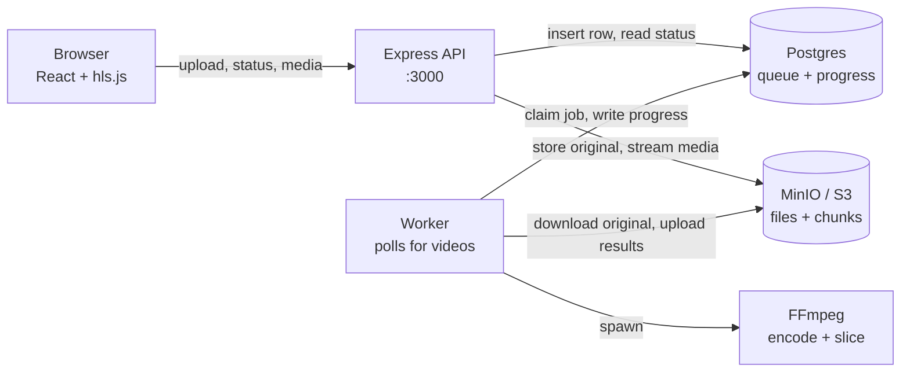
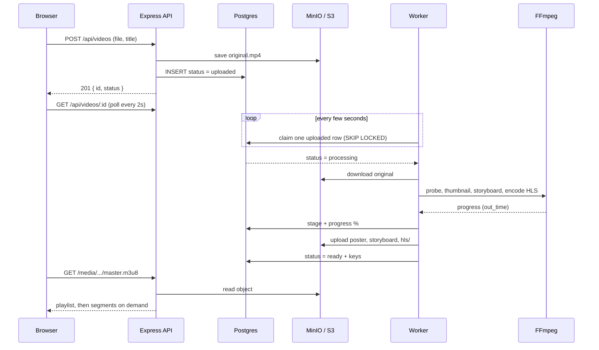
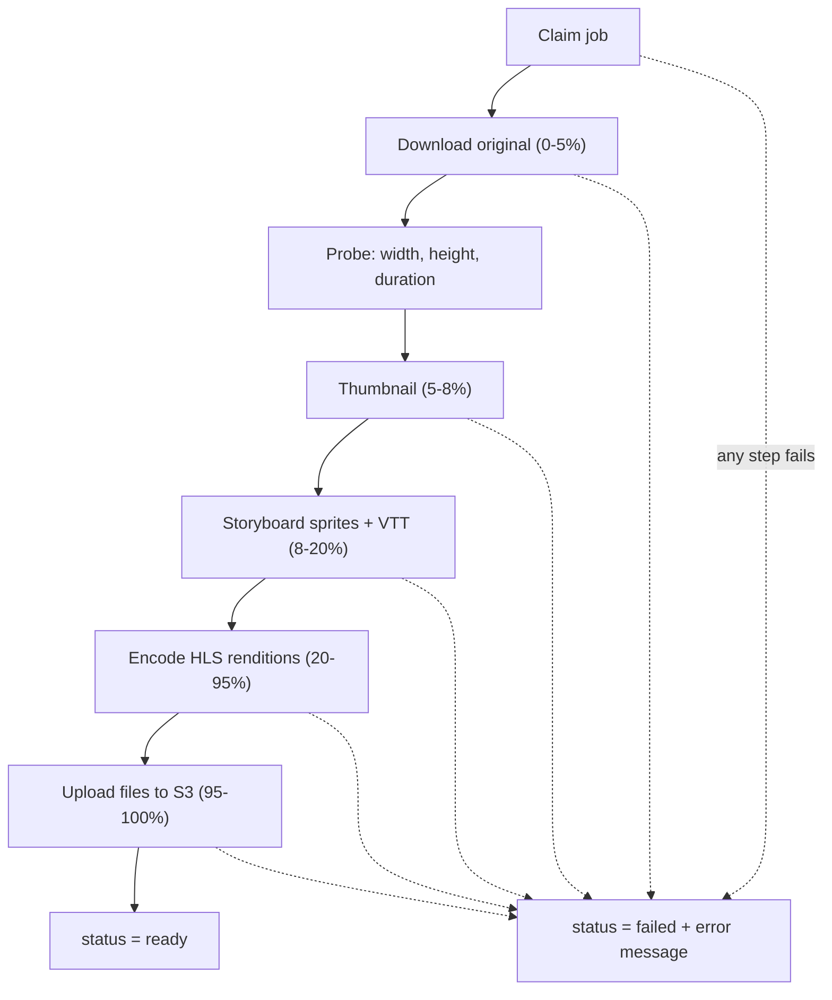
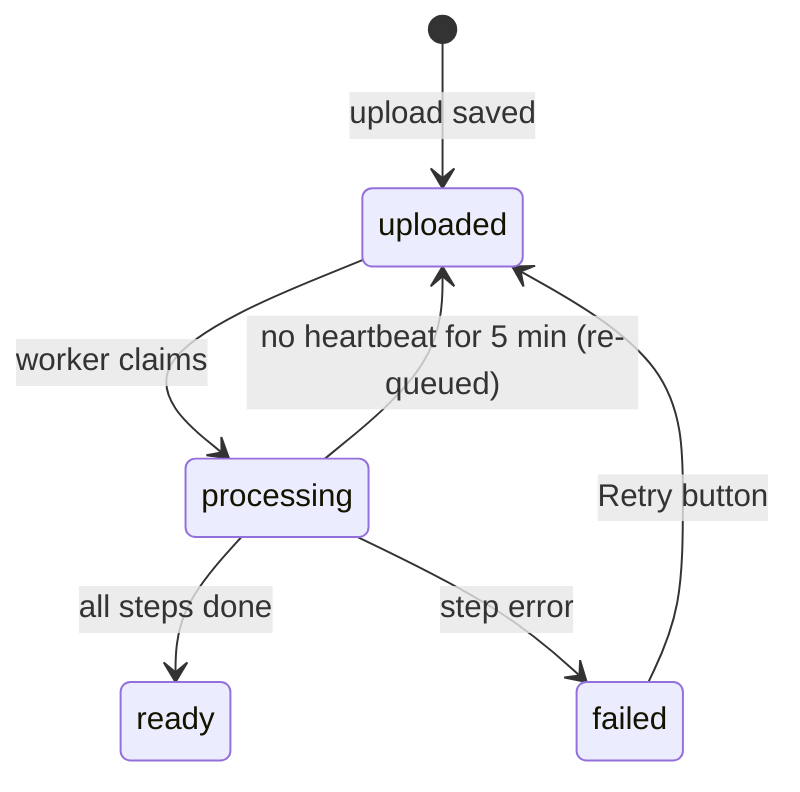

# Video Platform: Full Workflow

A YouTube-style video platform. Users upload one video, a background worker converts it into HLS chunks at several qualities, and a React player streams it with adaptive quality and seek-bar previews.

**Stack:** React + Vite (frontend) · Node.js + Express (API) · Postgres (queue + metadata) · MinIO/S3 (files) · FFmpeg (processing)

---

## 1. Architecture



| Component | Responsibility |
|---|---|
| Browser (React) | Library, upload page, video page with custom HLS player |
| Express API | Accepts uploads, exposes status, streams `/media/*` from S3 |
| Postgres | Holds video metadata, job status, stage and progress. Acts as the job queue |
| MinIO / S3 | Stores the original, thumbnail, storyboard and all HLS chunks |
| Worker | Separate Node process. Claims queued videos and runs the pipeline |
| FFmpeg | Probes, makes the thumbnail, storyboard sprites and HLS renditions |

---

## 2. End-to-end flow



### Step by step

1. **Upload.** The user picks a file on the Upload page. The browser sends it to `POST /api/videos` with a progress bar.
2. **Store the original.** The API writes it to `videos/{id}/original/original.mp4` in S3.
3. **Create the record.** The API inserts a row with `status = uploaded`, `stage = Queued`.
4. **Claim.** The worker polls Postgres and atomically claims one `uploaded` row (`FOR UPDATE SKIP LOCKED`), setting `status = processing`.
5. **Process.** The worker runs the pipeline in section 3. It writes the stage and percentage to Postgres as it goes.
6. **Show progress.** The Watch page polls `GET /api/videos/:id` every 2 seconds and shows stage, percentage and elapsed time.
7. **Finish.** The worker sets `status = ready` and saves `poster_key`, `storyboard_vtt_key`, `hls_master_key` and `duration`.
8. **Play.** The player loads `/media/videos/{id}/hls/master.m3u8`. hls.js picks a quality and downloads only the chunks it needs.

---

## 3. Worker pipeline



| Stage | Progress | What happens |
|---|---|---|
| Claim | 0% | One `uploaded` row becomes `processing` |
| Download original | 0 to 5% | S3 to a temp folder (`tmp/job_{id}/`) |
| Thumbnail | 5 to 8% | One frame at 10% of the duration, 1280px wide |
| Storyboard | 8 to 20% | One small frame every 10s, tiled into 10x10 sprite sheets, plus `storyboard.vtt` |
| Encode HLS | 20 to 95% | One FFmpeg run per rendition, 6-second `.ts` segments, then `master.m3u8` |
| Upload | 95 to 100% | Poster, storyboard and `hls/` folder to S3 |
| Ready | 100% | DB updated. Temp folder deleted. Original optionally deleted |

### Quality ladder

| Rendition | Video bitrate | Audio bitrate |
|---|---|---|
| 360p | 800k | 96k |
| 480p | 1400k | 128k |
| 720p | 2800k | 128k |
| 1080p | 5000k | 192k |

Renditions taller than the source are skipped (no upscaling). At least the 360p rendition is always made.

### Encoder selection

The worker checks FFmpeg at startup and picks an H.264 encoder:

1. `libx264` (best quality, uses CRF and preset)
2. `libopenh264` (fallback, used on Fedora's `ffmpeg-free`, uses a target bitrate)
3. Neither available: the job fails with a message explaining how to install the full FFmpeg

---

## 4. Video status lifecycle



### Reliability features

- **Heartbeat.** While processing, the worker updates `updated_at` every 15 seconds.
- **Stale recovery.** A `processing` job with no heartbeat for `STALE_JOB_MINUTES` (default 5) is claimed again by any worker.
- **Multiple workers.** `FOR UPDATE SKIP LOCKED` guarantees each video is claimed by one worker only.
- **Retry.** `POST /api/videos/:id/retry` re-queues a `failed` or stuck `processing` video, as long as the original still exists.
- **Cleanup.** The temp folder `tmp/job_{id}` is always removed, even on failure.

---

## 5. Storage layout (S3 / MinIO)

```text
videos/
└── {video_id}/
    ├── original/
    │   └── original.mp4          kept for re-processing (optional delete)
    ├── thumbnail/
    │   └── poster.jpg
    ├── storyboard/
    │   ├── sprite_0.jpg
    │   ├── sprite_1.jpg
    │   └── storyboard.vtt        seek-bar preview map
    └── hls/
        ├── master.m3u8           entry point for the player
        ├── 360p/   playlist.m3u8 + segment_000.ts ...
        ├── 480p/   playlist.m3u8 + segment_000.ts ...
        ├── 720p/   playlist.m3u8 + segment_000.ts ...
        └── 1080p/  playlist.m3u8 + segment_000.ts ...
```

Only the master playlist, poster and storyboard keys are stored in the database. The individual `.ts` chunks live only in S3. The `/media` route blocks the `original/` folder so the source file is never public.

---

## 6. Database

```sql
CREATE TABLE videos (
    id                     UUID PRIMARY KEY DEFAULT gen_random_uuid(),
    title                  VARCHAR(255) NOT NULL,
    description            TEXT,
    status                 VARCHAR(20) NOT NULL DEFAULT 'uploaded',
    duration               DECIMAL(10,2),
    original_key           TEXT,
    poster_key             TEXT,
    storyboard_vtt_key     TEXT,
    hls_master_key         TEXT,          -- nullable until processing finishes
    error_message          TEXT,
    stage                  TEXT,          -- e.g. "Encoding 720p (2 of 4)"
    progress               SMALLINT NOT NULL DEFAULT 0,
    processing_started_at  TIMESTAMPTZ,
    created_at             TIMESTAMPTZ DEFAULT NOW(),
    updated_at             TIMESTAMPTZ DEFAULT NOW()
);
```

`hls_master_key` is nullable because the key is unknown until processing finishes.

---

## 7. API reference

| Method | Path | Purpose |
|---|---|---|
| `POST` | `/api/videos` | Upload (multipart: `file`, `title`, `description`) |
| `GET` | `/api/videos` | List the latest 100 videos |
| `GET` | `/api/videos/:id` | One video with status, stage, progress |
| `POST` | `/api/videos/:id/retry` | Re-queue a failed or stuck video |
| `GET` | `/media/videos/...` | Stream playlists, segments, poster, storyboard from S3 |
| `GET` | `/health` | Health check |

Example response while processing:

```json
{
  "id": "877861ef-de8d-46c1-add3-68cc2af34c1b",
  "title": "My video",
  "status": "processing",
  "stage": "Encoding 720p (2 of 4)",
  "progress": 47,
  "processingStartedAt": "2026-10-03T10:12:00.000Z"
}
```

When `status` is `ready`, the response also includes `posterUrl`, `storyboardUrl` and `hlsUrl`.

---

## 8. Frontend

| Page | Route | Behavior |
|---|---|---|
| Library | `/` | Grid of videos. Auto-refreshes while any video is processing |
| Upload | `/upload` | Drag and drop, title, description, upload progress bar |
| Watch | `/watch/:id` | Player when ready. Live stage, percentage and timer while processing. Error and Retry when failed |

### Player features

- Adaptive quality (Auto) or manual choice: 360p to 1080p
- Seek-bar thumbnail previews from `storyboard.vtt` and sprite sheets
- Buffered progress, volume, fullscreen, auto-hiding controls
- Keyboard: `Space`/`K` play, `←`/`→` seek 5s, `J`/`L` seek 10s, `M` mute, `F` fullscreen

---

## 9. Configuration (`.env`)

| Variable | Default | Meaning |
|---|---|---|
| `PORT` | `3000` | API port |
| `DATABASE_URL` | none | Postgres connection string |
| `S3_ENDPOINT` / `S3_BUCKET` | none | MinIO or S3 location |
| `S3_ACCESS_KEY` / `S3_SECRET_KEY` | none | Storage credentials |
| `HLS_SEGMENT_SECONDS` | `6` | Chunk length |
| `HLS_PRESET` | `veryfast` | x264 speed preset (`ultrafast` is faster, larger files) |
| `FFMPEG_THREADS` | `0` | 0 = use all cores |
| `STORYBOARD_INTERVAL_SECONDS` | `10` | One preview frame every N seconds |
| `DELETE_ORIGINAL_AFTER_PROCESSING` | `false` | Remove the source after success |
| `STALE_JOB_MINUTES` | `5` | Re-queue jobs with no heartbeat |
| `WORKER_POLL_MS` | `3000` | How often the worker checks for jobs |

Frontend: `VITE_API_URL` (production only). In development, Vite proxies `/api` and `/media` to the backend.

---

## 10. Running it

Requirements: Node 18+, Docker, FFmpeg with an H.264 encoder.

```bash
# Backend
docker compose up -d          # Postgres + MinIO
npm install
npm run db:init               # creates tables and bucket
npm start                     # terminal 1: API on :3000
npm run worker                # terminal 2: processor

# Frontend
npm install
npm run dev                   # http://localhost:5173
```

### FFmpeg on Fedora

Fedora's default `ffmpeg-free` has no `libx264`. The worker falls back to `libopenh264`, which works but gives larger files. For the best result:

```bash
sudo dnf install https://mirrors.rpmfusion.org/free/fedora/rpmfusion-free-release-$(rpm -E %fedora).noarch.rpm
sudo dnf swap ffmpeg-free ffmpeg --allowerasing
ffmpeg -encoders | grep 264     # should list libx264
```

---

## 11. Troubleshooting

| Symptom | Likely cause | Fix |
|---|---|---|
| Stuck on "Waiting in the queue" | Worker is not running | Start `npm run worker` |
| "Processing" for a long time | Long 1080p video encoding on CPU | Watch the percentage and worker logs. Try `HLS_PRESET=ultrafast` |
| Progress stops moving | Worker crashed | Wait for stale recovery (5 min) or click Restart processing |
| `Unknown encoder 'libx264'` | FFmpeg built without x264 | Install the full FFmpeg (see section 10) |
| Failed with an error message | FFmpeg or S3 error | Read the message, fix it, click Retry processing |
| Player does not load | API or S3 not reachable | Check `/health`, MinIO and the `/media` proxy |

---

## 12. Production notes

- Serve `/media` through a CDN or use presigned URLs instead of proxying through Node.
- Add authentication and per-user ownership of videos.
- Run several workers for throughput. Each claims a different video.
- Set `DELETE_ORIGINAL_AFTER_PROCESSING=true` to save storage once you no longer need re-processing.
- Add upload size limits and virus scanning if users are untrusted.
